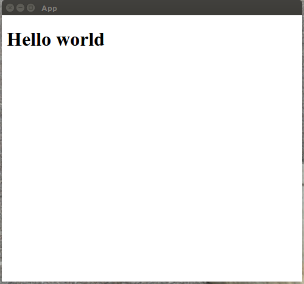
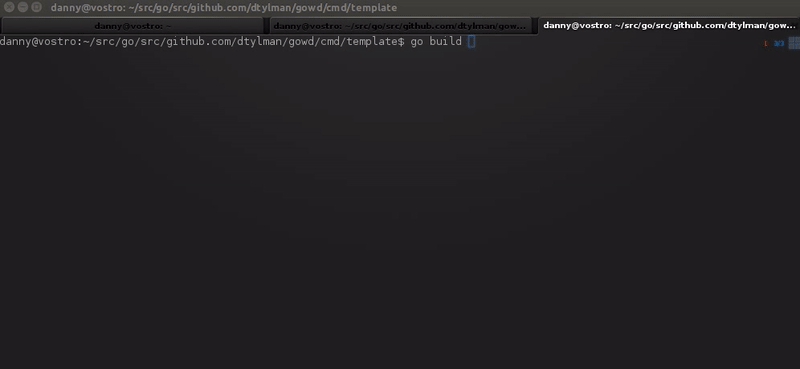
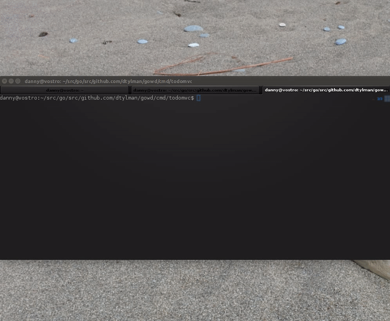

# gowd

Build cross platform GUI apps with GO and HTML/JS/CSS (powered by [nwjs](https://nwjs.io/))

[](https://circleci.com/gh/dtylman/gowd)
[](https://goreportcard.com/report/github.com/dtylman/gowd)
[](http://godoc.org/github.com/dtylman/gowd)

### How to use this library:

1. Download and install [nwjs](https://nwjs.io/)
1. Install this library `go get github.com/dtylman/gowd`
1. Clone this repo.
1. Place `package.json`, `index.html`, `main.go` and `main.js` from [template](cmd/template/) in a new folder. 
1. `go build`
1. Edit `main.js` and set `goBinary` to your your executable name:
    ```javascript
    var goBinary = "./template"; //or template.exe
    ```
1. Run `nw .`, the hello world template should appear:


### Usage

Simplest "hello world":
```go

import "github.com/dtylman/gowd"

func main() {
	body, err := gowd.ParseElement("<h1>Hello world</h1>", nil)
	if err != nil {
		panic(err)
	}
	gowd.Run(body)
}

```

Adding a button:

```go

import (
	"github.com/dtylman/gowd"
)

func main() {
	body, err := gowd.ParseElement("<h1>Hello world</h1>", nil)
	if err != nil {
		panic(err)
	}
	p := body.AddElement(gowd.NewElement("p"))
	btn := p.AddElement(gowd.NewElement("button"))
	btn.SetText("Click me")
	btn.OnEvent(gowd.OnClick, btnClicked)
	gowd.Run(body)
}

func btnClicked(sender *gowd.Element, event *gowd.EventElement) {
	sender.SetText("Clicked!")
}
```

Creating and binding from HTML:
```go
import (
	"github.com/dtylman/gowd"
	"fmt"
)

func main() {
	body, err := gowd.ParseElement("<h1>Hello world</h1>", nil)
	if err != nil {
		panic(err)
	}
	p := body.AddElement(gowd.NewElement("p"))
	em := gowd.NewElementMap()
	p.AddHtml(`<select id="select1">
		<option value="" disabled="disabled" selected="selected">Please select a name</option>
		<option value="1">One</option>
		<option value="2">Two</option>
		</select>`, em)
	em["select1"].OnEvent(gowd.OnChange, btnClicked)
	em["select1"].Object = body
	gowd.Run(body)
}

func btnClicked(sender *gowd.Element, event *gowd.EventElement) {
	body := sender.Object.(*gowd.Element)
	body.AddElement(gowd.NewStyledText(fmt.Sprintf("Selected %s", event.GetValue()), gowd.BoldText))
	body.AddElement(gowd.NewElement("br"))
}
```

Using bootstrap:

'gowd' supports creating bootstrap elements using the [bootstrap](bootstrap/) package.

First, add bootsrap css and js to your `index.html` file:
```html
    <script type="text/javascript" src="js/jquery.min.js"></script>
    <link rel="stylesheet" type="text/css" href="css/bootstrap.min.css"/>
    <script type="text/javascript" src="js/bootstrap.min.js"></script>
```

Then you can create bootsrap items:

```go

import (
	"github.com/dtylman/gowd"

	"github.com/dtylman/gowd/bootstrap"
	"time"
	"fmt"
)

var body *gowd.Element

func main() {
	//creates a new bootstrap fluid container
	body = bootstrap.NewContainer(false)
	// add some elements using the object model
	div := bootstrap.NewElement("div", "well")
	row := bootstrap.NewRow(bootstrap.NewColumn(bootstrap.ColumnLarge, 6, div))
	body.AddElement(row)
	// add some other elements from HTML
	div.AddHtml(`<div class="dropdown">
	<button class="btn btn-primary dropdown-toggle" type="button" data-toggle="dropdown">Dropdown Example
	<span class="caret"></span></button>
	<ul class="dropdown-menu" id="dropdown-menu">
	<li><a href="#">HTML</a></li>
	<li><a href="#">CSS</a></li>
	<li><a href="#">JavaScript</a></li>
	</ul>
	</div>`, nil)
	// add a button to show a progress bar
	btn := bootstrap.NewButton(bootstrap.ButtonPrimary, "Start")
	btn.OnEvent(gowd.OnClick, btnClicked)
	row.AddElement(bootstrap.NewColumn(bootstrap.ColumnLarge, 4, bootstrap.NewElement("div", "well", btn)))

	//start the ui loop
	gowd.Run(body)
}

// happens when the 'start' button is clicked
func btnClicked(sender *gowd.Element, event *gowd.EventElement) {
	// adds a text and progress bar to the body 
	text := body.AddElement(gowd.NewStyledText("Working...", gowd.BoldText))
	progressBar := bootstrap.NewProgressBar()
	body.AddElement(progressBar.Element)
	
	// makes the body stop responding to user events
	body.Disable()
	
	// clean up - remove the added elements
	defer func() {
		body.RemoveElement(text)
		body.RemoveElement(progressBar.Element)
		body.Enable()
	}()

	// render the progress bar
	for i := 0; i <= 123; i++ {
		progressBar.SetValue(i, 123)
		text.SetText(fmt.Sprintf("Working %v", i))
		time.Sleep(time.Millisecond * 20)
		// this will cause the body to be refreshed
		body.Render()
	}

}
```

This will yield the following app:



More a more advanced usage, see the [Todo](cmd/todomvc/readme.md) sample



