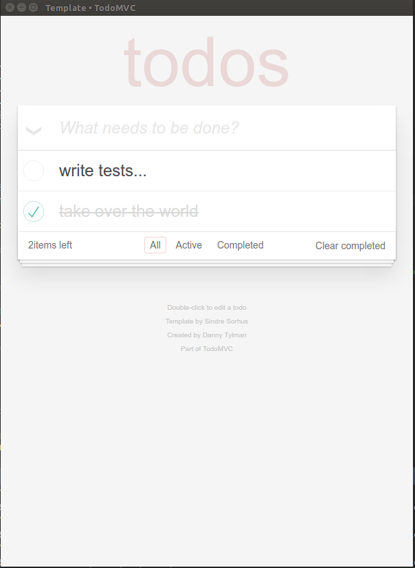

# gowd • [TodoMVC](http://todomvc.com)

> Implementation of TodoMVC using 'gowd'.

## Building

#### Prerequisites

* The `go` programming language (dah!) from [here](https://golang.org/dl/).
* `nwjs` chromium engine from [here](https://nwjs.io/downloads/).
* `npm` package manager from [here](https://www.npmjs.com/).

To build & run this sample:

```bash
cd $GOPATH/github.com/dtylman/gowd/cmd/todomvc
npm install
go build
nw .
```

Screenshot on Ubuntu:



## Resources

- gowd on [github](http://github.com/dtylman/gowd) 


## Credit

Created by [Danny Tylman](http://your-website.com)
